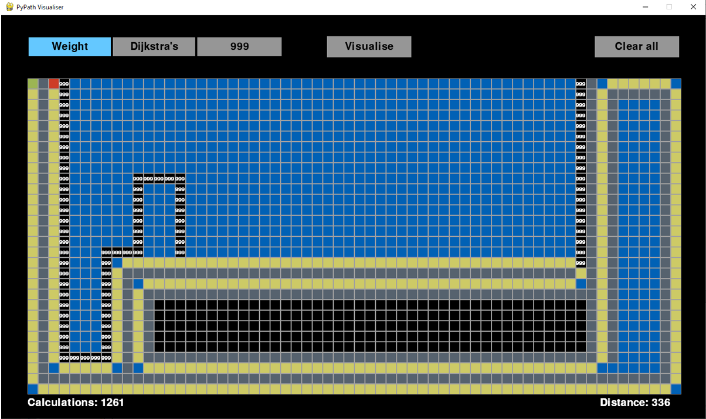
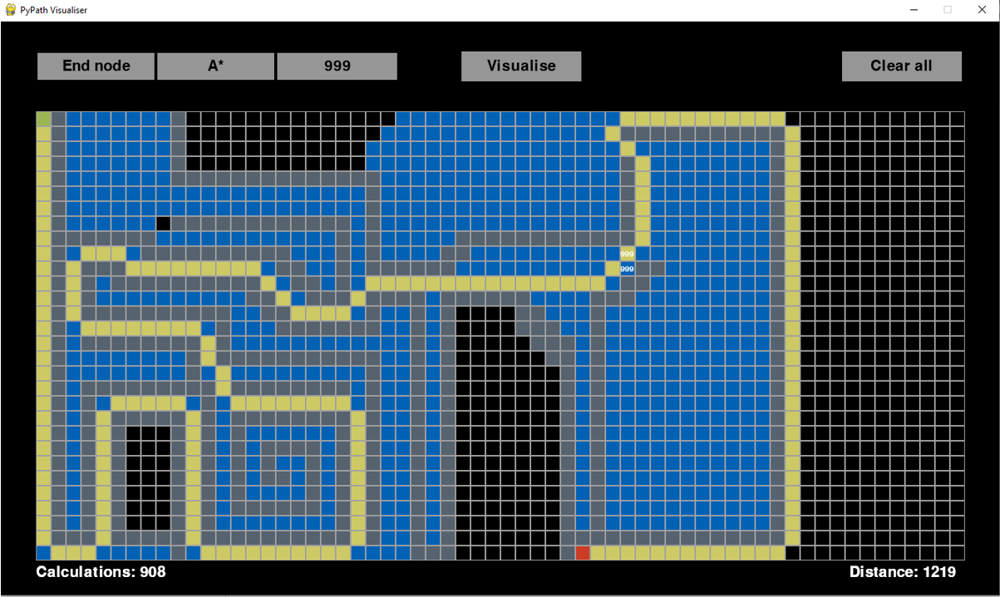

# PyPathVisualiser
This is a project for OCR H446 A-Level Computer Science. It is an attempt at creating a pathfinding visualiser using Python and PyGame.

### Features

- PyPath Visualiser is a GUI application for visualizing pathfinding algorithms.
- It uses PyGame library for rendering graphics.
- It reads settings from a JSON file which allows for a customisable interface.
- It supports Dijkstra and A* pathfinding algorithms.
- Allows for the placement of Auxiliary nodes.
- Ability to place weighted nodes.

   
  

